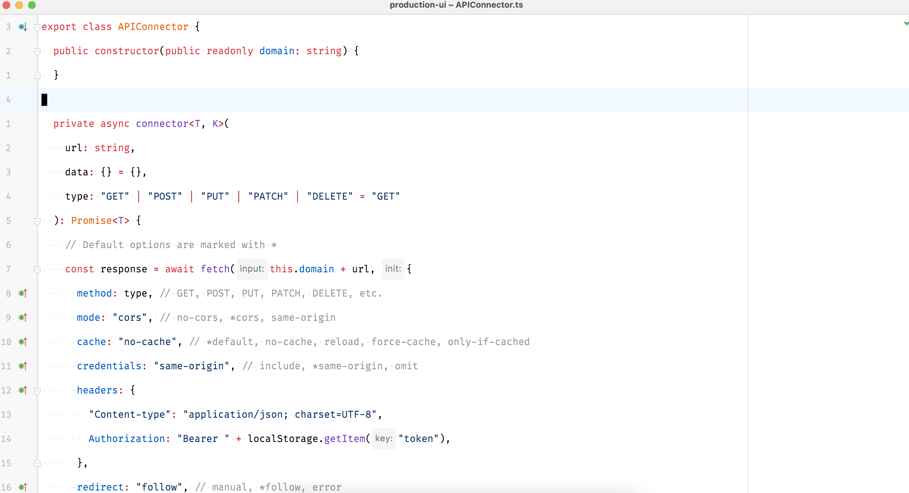
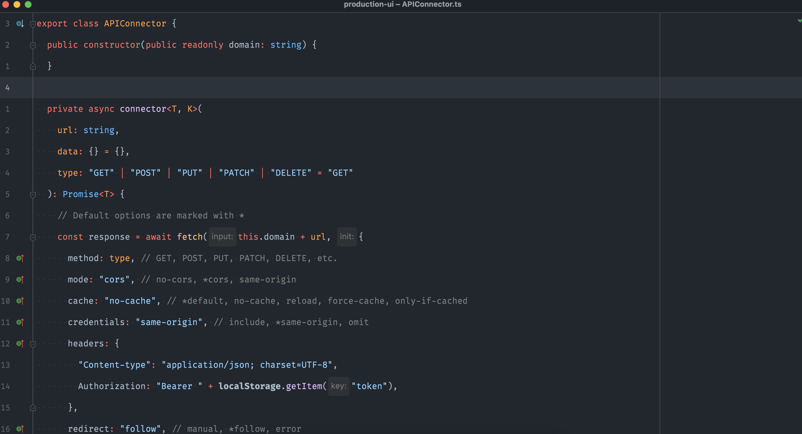

<p align="center"><a href="https://plugins.jetbrains.com/plugin/15418-github3-theme" target="_blank"></a></p>

<p align="center"><h1 align="center">GitHub Theme for JetBrains</h1></p>


[](https://plugins.jetbrains.com/plugin/15418-github-theme)
[](https://plugins.jetbrains.com/plugin/15418-github-theme)

<!-- Plugin description -->
[GitHub Theme for Jetbrains](https://plugins.jetbrains.com/plugin/15418-github-theme) is heavily inspired
by [GitHub 3 Color Scheme](https://plugins.jetbrains.com/plugin/12271-github-3-color-scheme)
and [github-vscode-theme](https://github.com/primer/github-vscode-theme).

The focus of the development of this theme plugin is to restore the official GitHub theme as much as possible, keeping
the colors easy to distinguish, proper contrast, and pleasant.

Thanks to [Jiyuan Su](https://github.com/jiyuan0125) for building such a nice looking theme and outstanding contributions to the project.

<!-- Plugin description end -->

## Light



## Dark Dimmed



More [screenshots](readme/screenshot.md)

## Installation

- If you just need to install this plugin then you could install it from official Jetbrains Plugin Store
  from [here](https://plugins.jetbrains.com/plugin/15418-github3-theme)

- Using IDE built-in plugin system:

  <kbd>Settings/Preferences</kbd> > <kbd>Plugins</kbd> > <kbd>Marketplace</kbd> > <kbd>Search for "GitHub Theme"</kbd> >
  <kbd>Install Plugin</kbd>

- Manually:

  Download the [latest release](https://github.com/bhushan/github-theme-for-jetbrains/releases/latest) and install it
  manually using
  <kbd>Settings/Preferences</kbd> > <kbd>Plugins</kbd> > <kbd>⚙️</kbd> > <kbd>Install plugin from disk...</kbd>

## Build from Source

### Prerequisites

Gradle runs on all major operating systems and requires only a [Java Development](https://jdk.java.net/) Kit version 8
or higher to run. To check, run java -version. You should see something like this:

```bash
$java -version
java version "1.8.0_151"
Java(TM) SE Runtime Environment (build 1.8.0_151-b12)
Java HotSpot(TM) 64-Bit Server VM (build 25.151-b12, mixed mode)
```

### Build

```bash
$./gradlew build
```

The generated target files are located in build/libs.


## Our valuable Contributors👩‍💻👨‍💻 :

<a href="https://github.com/bhushan/github-theme-for-jetbrains/graphs/contributors">
  
</a>

## Enjoy Beautiful IDE and Happy Coding !!
